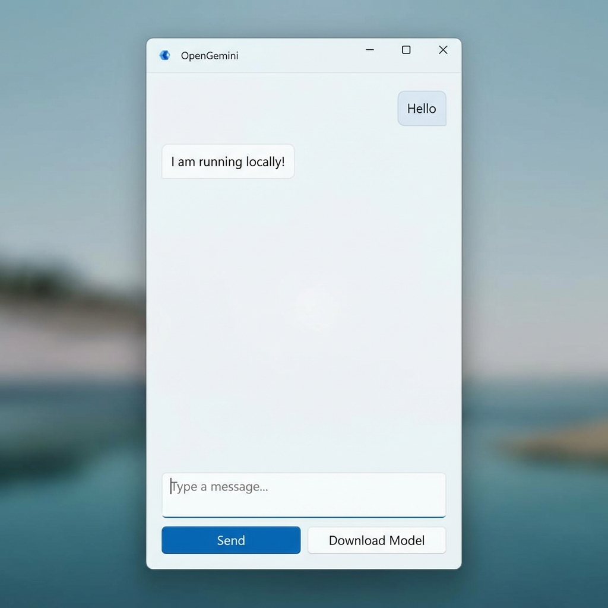

# OpenGemini 🦞

A native Windows 11 implementation of the OpenGemini AI Assistant, featuring a Hybrid AI Engine (Local Phi-3 + Google Gemini) and Slack integration.

## Features

### 🧠 Hybrid AI Engine
-   **Local Intelligence**: Runs **Phi-3-mini-4k-instruct** locally on your device using **OnnxRuntime w/ DirectML**.
    -   **Zero Cost**: No API fees for local queries.
    -   **Privacy First**: Processing happens on your machine.
    -   **NPU/GPU Accelerated**: Automatically uses your dedicated GPU (e.g., NVIDIA RTX 5090) or NPU.
-   **Cloud Intelligence**: seamlessly falls back to **Google Gemini** for complex reasoning (Simulated/Planned).

### 💬 Connectivity
-   **Native Slack Integration**: 
    -   Connects via **Socket Mode** (no firewall changes needed).
    -   Chat with your bot vertically from Slack or the App.
    -   Supports two-way communication.
-   **WinUI 3 Interface**: Modern, responsive, and native Windows experience.

### 🛠️ capabilities
-   **Auto-Healing Model**: Automatically downloads the ~2.2GB Model if missing or corrupted.
-   **Resilient Downloads**: Verifies file integrity and supports resume/retry with real-time byte progress.
-   **Copy Response**: One-click copy for AI responses.
-   **Compact Mode**: Launches in a messenger-style vertical window.

## Technical Details
-   **Language**: C# / .NET 9
-   **UI Framework**: WinUI 3 (Windows App SDK)
-   **AI Runtime**: ONNX Runtime GenAI (DirectML)
-   **Slack Library**: SlackNet

## Getting Started

### Prerequisites
-   Windows 10/11 (Developer Mode enabled recommended)
-   Target GPU for acceleration (NVIDIA/AMD/Intel)

### Installation
1.  Clone the repository.
2.  Open in VS Code or Visual Studio.
3.  Run `dotnet run`.

### Configuration (Slack)
To enable Slack, set the following environment variables:
-   `SLACK_APP_TOKEN`: `xapp-...`
-   `SLACK_BOT_TOKEN`: `xoxb-...`

## Model Management
The app will automatically download the required models on first launch.
If you need to force a re-download, click the **"Download Model"** button in the UI.

## License
MIT
