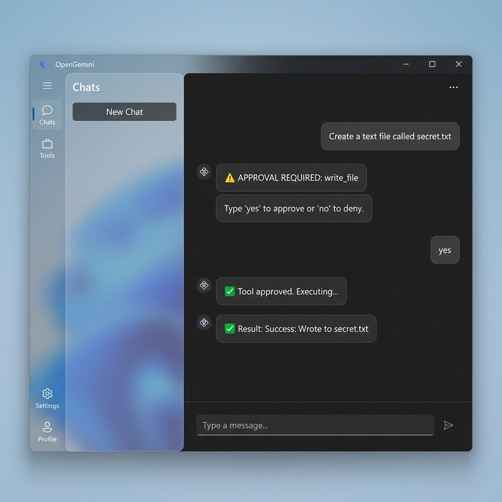

# Super Agent 🦸‍♂️



**Super Agent 🦸‍♂️** is a next-generation AI agent for Windows, designed to be a **Thinking Partner** that lives on your desktop.

It combines the reasoning power of **Google Gemini** with native local capabilities, giving it long-term memory, system control, and internet access.

## 🚀 Key Capabilities

### 1. 🧠 Long-Term Memory (RAG)
The Super Agent never forgets. It uses a vector database to store and recall your conversations.
- **Auto-Memorization**: Every interaction is vectorized and stored locally.
- **Context Awareness**: Before answering, it searches its memory for relevant context.
- **Privacy Focus**: Memories are stored in a local SQLite database (`messages.db`), not in the cloud.

### 2. 🌐 Web Access (New!)
The agent is connected to the live internet.
- **`web_search`**: Can search DuckDuckGo for real-time information.
- **`read_web_page`**: Can read and analyze the content of any website.
- **Zero-Config**: No extra API keys required for web search.

### 3. 🛠️ Action Space
The agent can "touch" your system to get work done.
- **Create Files**: Can write code, notes, and logs to your Documents folder.
- **System Control**: Can execute PowerShell commands (with your permission).
- **Safe by Design**: Dangerous actions require your explicit `yes` approval.

## 📦 Installation

### Prerequisites
- Windows 10 or 11 (build 19041+)
- [.NET 8 SDK](https://dotnet.microsoft.com/download)
- [Google Gemini API Key](https://aistudio.google.com/)

### Setup
1.  **Clone the repository**:
    ```powershell
    git clone https://github.com/dparksports/super-agent.git
    cd super-agent
    ```

2.  **Set your API Key**:
    ```powershell
    setx GEMINI_API_KEY "your_gemini_api_key_here"
    ```
    *(Restart your terminal after setting this)*

3.  **Run the App**:
    ```powershell
    dotnet run
    ```

## 🏗️ Architecture

- **UI**: WinUI 3 (Windows App SDK)
- **AI Model**: Google Gemini Pro (via REST API)
- **Embeddings**: `text-embedding-004`
- **Database**: SQLite (Microsoft.Data.Sqlite)
- **Search**: HtmlAgilityPack + DuckDuckGo HTML

## 🛡️ Safety

Super Agent is designed with a **Human-in-the-Loop** safety architecture.
- **Read-Only by Default**: The agent can read web pages and memory freely.
- **Write Protected**: Any tool that modifies the system (`write_file`, `run_powershell`) triggers a safety interrupt.
- **User Authority**: The agent halts and waits for user approval before proceeding with unsafe actions.

---
*Built with ❤️ in California.*
